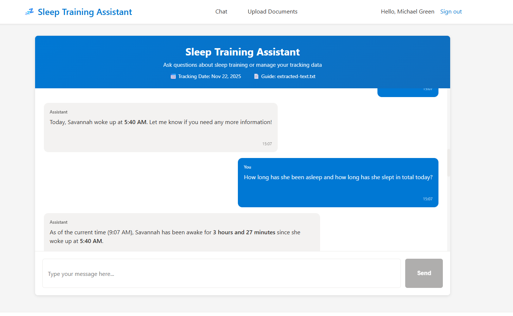

# Sleep Training Assistant

An AI-powered sleep training assistant built with Blazor Server and Azure OpenAI. The application helps track and manage Savannah's sleep training by answering questions from a sleep training guide (PDF) and automatically tracking daily sleep data through conversational AI.

## Features

- 💬 **Conversational AI Chat**: Interactive chat UI with markdown rendering powered by Azure OpenAI GPT-4o-mini
- 📄 **PDF Q&A**: Answer questions from a sleep training guide with automatic text extraction
- 📊 **AI Function Calling**: Automatically track sleep data (wake times, naps, bedtime) by chatting naturally
- 📈 **Historical Queries**: Ask about past sleep data - "What time did she wake up yesterday?" or "How were her naps this week?"
- 🗄️ **Azure Table Storage**: Persistent daily sleep tracking with automatic entity creation
- ⏰ **Time-Aware AI**: Current CDT time automatically included in every AI prompt
- 🎨 **Markdown Support**: Beautiful formatting with tables, bold text, lists, and code blocks
- 🔐 **Secure**: Managed Identity authentication with RBAC roles and public network access disabled for storage keys
- ☁️ **Azure Native**: Fully deployed on Azure with infrastructure as code

## Architecture

- **Frontend**: Blazor Server (.NET 8) with Markdig for markdown rendering
- **AI Model**: Azure OpenAI GPT-4o-mini with function calling
- **PDF Processing**: PdfPig for text extraction
- **Data Storage**: Azure Table Storage for daily sleep tracking
- **Blob Storage**: Azure Blob Storage for PDF content
- **Authentication**: Managed Identity with RBAC roles
- **Deployment**: Azure Developer CLI (azd) with Bicep IaC

## Prerequisites

- [Azure Developer CLI (azd)](https://learn.microsoft.com/azure/developer/azure-developer-cli/install-azd)
- [.NET 8 SDK](https://dotnet.microsoft.com/download/dotnet/8.0)
- [Azure Subscription](https://azure.microsoft.com/free/)
- Access to Azure OpenAI Service (requires approval)

## Local Development Setup

### 1. Clone and Initialize

```bash
cd sleep-training-assistant
azd auth login
```

### 2. Configure Environment Variables

Create a new environment:

```bash
azd env new <environment-name>
```

Set optional variables:

```bash
# Optional: PDF file URL (can be set later or uploaded to blob storage)
azd env set PDF_FILE_URL "https://path-to-your-pdf-file.pdf"

# Optional: Azure AD credentials for authentication
azd env set AZURE_AD_TENANT_ID "your-tenant-id"
azd env set AZURE_AD_CLIENT_ID "your-app-registration-client-id"
```

## Deployment

### Deploy Everything with One Command

```bash
azd up
```

This command will:
1. Provision all Azure resources (App Service, OpenAI, Storage Account, Table Storage)
2. Configure managed identity and RBAC roles
3. Deploy the Blazor application with automatic sleep tracking

**Deployment time**: ~5-10 minutes

### Post-Deployment Configuration

#### Upload PDF File (Optional)

You can either set the PDF URL or upload directly to blob storage:

**Option 1: Set PDF URL in App Service**
1. Go to **App Service** → **Configuration** → **Application settings**
2. Update `PDF_FILE_URL` with your PDF URL
3. Click **Save**

**Option 2: Upload to Blob Storage**
```bash
STORAGE_ACCOUNT=$(azd env get-value AZURE_STORAGE_ACCOUNT_NAME)
az storage blob upload \
  --account-name $STORAGE_ACCOUNT \
  --container-name pdf-content \
  --name sleep-training-guide.pdf \
  --file /path/to/your/file.pdf \
  --auth-mode login
```

The app will automatically extract text from the PDF using PdfPig and make it available to the AI.

## Application Usage

### Access the Application

After deployment, get your app URL:

```bash
azd env get-value SERVICE_WEB_URI
```

Visit the URL and sign in with your Entra ID account.

### How It Works

The AI automatically tracks sleep data through natural conversation. Just tell it what happened:

**Track today's sleep events:**
```
She woke up at 7 AM
Put her in crib for nap 1 at 9:30
She fell asleep at 9:45
Woke from nap 1 at 11:15
Fed her at 6 PM
She woke up at 11:30 PM and went back to sleep at 11:45 PM
```

**Query historical data:**
```
What time did she wake up yesterday?
How consistent were her naps this week?
Show me last Tuesday's sleep data
Compare today's bedtime to yesterday's
```

**Ask questions about the guide:**
```
What are the key principles of sleep training?
Show me today's sleep data in a table
How long was nap 1?
When should the next nap be?
```

The AI uses function calling to automatically update Azure Table Storage for current data and query historical records for past dates. All responses are formatted with markdown tables, lists, and formatting.



## Project Structure

```
sleep-training-assistant/
├── src/
│   └── BlazorApp/
│       ├── Components/
│       │   ├── Pages/
│       │   │   ├── Chat.razor           # Main chat with markdown rendering
│       │   │   └── Upload.razor         # PDF upload page
│       │   └── Layout/
│       │       └── MainLayout.razor
│       ├── Services/
│       │   ├── AzureOpenAIService.cs    # AI chat with function calling (update + query tools)
│       │   ├── TableStorageService.cs   # Sleep tracking data (current + historical)
│       │   ├── PdfService.cs            # PDF text extraction (PdfPig)
│       │   └── TimeService.cs           # CDT timezone utilities
│       ├── Models/
│       │   ├── ChatMessage.cs
│       │   └── SleepTrackingEntity.cs   # Table Storage entity
│       └── Program.cs
├── infra/                        # Infrastructure as Code (Bicep)
│   ├── main.bicep
│   └── modules/
│       ├── app-service.bicep     # App Service with managed identity
│       ├── openai.bicep          # Azure OpenAI deployment
│       ├── storage.bicep         # Storage with firewall rules
│       └── openai-role.bicep     # RBAC role assignments
└── azure.yaml                    # Azure Developer CLI config
```

## Cost Estimate

| Resource | Tier | Monthly Cost |
|----------|------|--------------|
| App Service Plan | B1 (Linux) | ~$13 |
| Azure OpenAI | GPT-4o-mini usage | ~$5-15 |
| Storage Account | Standard LRS | ~$0.50 |
| **Total** | | **~$20-30/month** |

## Configuration Reference

### Environment Variables

Set these with `azd env set <name> <value>`:

| Variable | Required | Description |
|----------|----------|-------------|
| `PDF_FILE_URL` | Optional | URL to sleep training PDF |
| `AZURE_AD_TENANT_ID` | Optional | Entra ID tenant for authentication |
| `AZURE_AD_CLIENT_ID` | Optional | App registration client ID |

### App Settings (Auto-configured)

These are automatically set by the deployment:

- `AZURE_OPENAI_ENDPOINT`: Azure OpenAI endpoint
- `AZURE_OPENAI_DEPLOYMENT_NAME`: `4o-mini`
- `STORAGE_ACCOUNT_NAME`: Storage account for blobs/tables
- `STORAGE_CONTAINER_NAME`: `pdf-content`
- `STORAGE_TABLE_NAME`: `SleepTracking`

## Troubleshooting

### PDF text not loading

1. Check `PDF_FILE_URL` is set or PDF is uploaded to blob storage
2. Visit the Upload page to manually upload the PDF
3. Check App Service logs for PdfPig extraction errors

### Sleep tracking not saving

1. Verify storage account firewall allows App Service outbound IPs
2. Check managed identity has Table Storage Data Contributor role
3. View logs for Azure Table Storage connection errors

### AI not tracking data automatically

1. Ensure you're using natural language like "She woke up at 7 AM"
2. Check logs to see if the AI is calling the `update_sleep_tracking` function
3. Verify the function call arguments in the logs

### View Logs

```bash
# Stream logs in real-time
az webapp log tail \
  --name $(azd env get-value SERVICE_WEB_NAME) \
  --resource-group $(azd env get-value AZURE_RESOURCE_GROUP)
```

## Clean Up

To delete all resources:

```bash
azd down
```

This will delete the resource group and all resources.

## Key Technologies

- **Markdig**: Markdown to HTML conversion with advanced extensions
- **PdfPig**: Pure .NET PDF text extraction
- **Azure.Data.Tables**: Table Storage SDK with managed identity
- **OpenAI Function Calling**: Structured data extraction from conversation
- **Blazor Server**: Real-time server-side rendering
- **Azure RBAC**: Role-based access control for storage

## Security Features

- **Managed Identity**: No stored credentials for Azure services
- **RBAC Roles**: Storage Blob Data Contributor, Storage Table Data Contributor
- **Storage Firewall**: Only App Service outbound IPs allowed
- **HTTPS Only**: TLS 1.2 minimum
- **No Shared Keys**: Storage account uses Entra ID authentication only

---

**Need Help?**

- [Azure Developer CLI Documentation](https://learn.microsoft.com/azure/developer/azure-developer-cli/)
- [Azure OpenAI Documentation](https://learn.microsoft.com/azure/ai-services/openai/)
- [Azure Table Storage Documentation](https://learn.microsoft.com/azure/storage/tables/)
- [Markdig GitHub](https://github.com/xoofx/markdig)
